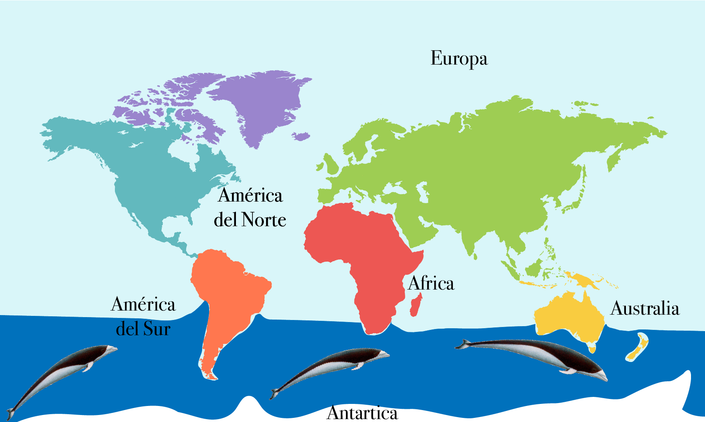

DELFÍN LISO AUSTRAL
======

~~~
Integrantes / Roles

Miro: https://miro.com/app/board/o9J_lAF-rWs=/

Echeverria, Gabriela : Investigación - poco ilustración
Hrepic, Paula        : Ilustración - Investigación - Manualidades
Jimenez, Eliana      : Ilustración - Investigación
Martinez, Trinidad   : Programar - ilustración
Soto, Cecy           : Ilustración - investigación - programación
~~~

## TEMA:

NOMBRE CIENTÍFICO: Lissodelphis peronii (Lacépède, 1804). También llamado **Delfín liso austral o Tunina sin aleta**.
               
| Reino:      | *Animalia*         | Orden:  | *Cetartiodactyla* |
| :------------- |:-----| :-----|:------------------|
| **Phyllum/División:**     | *Chordata* | **Familia:** |  *Delphinidae*     |
| **Clase:**     |  *Mammalia*      |   **Género:** |  *Lissodelphis*    |
 

#### 1. Morfología:
 
* Características:

     * Sin aleta dorsal.
     * Cuerpo delgado, forma torpedo.
     * Negro con vientre blanco (división clara).
     * Rostro corto y blanco.
     * Natación con saltos.
     * Cuerpo sale del agua con un ángulo bajo.
     
* Tamaño:
     * Tamaño Adulto: 1.8 - 2.9 m (60 - 100 kg.)
     * Tamaño Cria: 80 - 100 cm.
     

 #### 2. Hábitat 
Los delfines lisos australes se encuentran sólo en aguas subantárticas templadas frías del hemisferio sur, en su mayoría entre los 30° S y 65° S. El límite sur
en general parece estar limitado por la convergencia antártica. Su rango se extiende más al norte por
la costa de los continentes, debido a las corrientes frías del hemisferio sur.

En la costa de Chile, los delfines lisos australes están
presentes durante todo el año y se ha descubierto que migran hacia el norte durante el invierno y la
primavera, siendo, al parecer las fuentes de alimentos el factor de migración (Jefferson et al. 1993,
Lipsky 2008). En Chile, existen registros entre la II y V Región y entre la X y XII Región. 

 

En el mapa se observan puntos rojos, los cuales representan avistamientos del delfin liso del sur, en zonas chilenas.

 #### 3. Conducta: 
Esta especie nada en grupos de dos a 1.000 individuos. Se asocian con otros cetáceos pequeños. Se desplazan dando grandes saltos, frecuentemente en parejas, a ras de la superficie del agua. Realizan "bowriding".

> _**Bow Riding** es cuando los delfines surfean en la ola creada por barcos y barcos. A medida que los barcos se mueven por el agua, crean una ola. Los delfines son impulsados ​​hacia adelante por la ola y, a menudo, giran y giran e incluso nadan boca abajo mientras se deslizan por el agua._

 #### 4. Alimentación:
Esta especie de delfín se alimenta principalmente de peces y calamares. 

 #### 5. Amenazas:
Los delfines lisos fueron cazados durante el siglo XIX por la industria ballenera. Algunos continúan siendo cazados en América del Sur.

 #### 6. Datos freaks de los delfines:
 - Se reconocen frente al espejo, lo cual los hace ser concientes de sí mismos.
 - Tienen la inteligencia de un niño de 10 años
 - Nunca duerme por completo, siempre mantienen un ojo abierto y alternan los hemisferios del cerebro para descansar.

#### ESTILOS GRÁFICOS

*PROPUESTA DE TIPOGRAFÍA

Ambas propuestas tienen diferentes pesos de sus lineas, lo cual hace un contraste entre el blanco y negro, similar a lo que sucede con esos mismos colores en el cuerpo del Delfín Liso Austral 

 - 1. Propuesta de tipografía Didot
Tipografía creada en 1783 por Alexey Kryukov, es una tipografía romana moderna.

 - 2. Propuesta de tipografía Recoleta
Tipografía creada en 2018 por Jorge Cisterna.

*PROPUESTA PALETA CROMÁTICA

Rescatar el blanco (crema) y negro del Delfín Liso Austral. Para generar contraste colores azulados que represen el contexto marítimo del animal.

#### REFERENCIAS INFOGRÁFICAS
* [They are very close... and you can’t escape them](https://multimedia.scmp.com/culture/article/cockroaches/)- Analisis morfológico, ciclo de vida, sistema digestivo, habitat, evolución.

* [Godzilla: evolution of a monster](https://multimedia.scmp.com/infographics/culture/article/3012245/godzilla/index.html?src=arcade)- Inspiración caracteristicas morfológicas, evolucion de tamaño (gráfico comparativo), funcionamiento sistema central.

* [Boars, snakes and black kites: where to spot wild animals in Hong Kong](https://multimedia.scmp.com/infographics/lifestyle/article/3031527/hong-kong-great-outdoors/index.html?src=arcade)- Estado de vulneración, enmarcación sistema natural.

* [Australian fires: Understanding the intensity and global impact](https://multimedia.scmp.com/infographics/news/world/article/3046510/australian-fires/index.html)- Despliegue horizontal de infografia.

* [China’s wildlife trade](https://multimedia.scmp.com/infographics/news/china/article/3064927/wildlife-ban/index.html)- Estilo gráfico, uso de color,uso de gráficos mixtos.

#### REFERENCIAS
* [Ficha de antecedentes de especie](http://www.mma.gob.cl/clasificacionespecies/fichas13proceso/fichas_PAC_13RCE/Lissodelphis_peronii_PAC_13RCE.pdf)
* [Inventario Nacional de especies Chilenas](http://especies.mma.gob.cl/CNMWeb/Web/WebCiudadana/ficha_indepen.aspx?EspecieId=3933&Version=1)
* [Centro de conservación Cetacea](https://ccc-chile.org/cetaceos/delfin-liso/)
* [Anatomía de los delfines](https://www-sciencedirect-com.pucdechile.idm.oclc.org/book/9780124072299/anatomy-of-dolphins)

