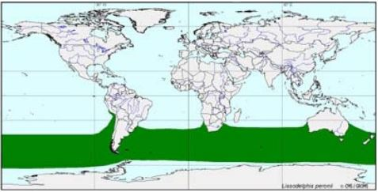
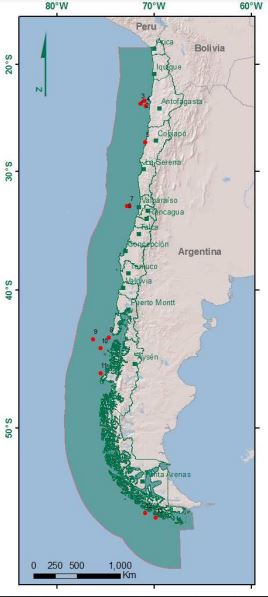

DELFÍN LISO AUSTRAL
======

~~~
Integrantes / Roles

Echeverria, Gabriela :
Hrepic, Paula        :
Jimenez, Eliana      :
Martinez, Trinidad   :
Soto, Cecy          :
~~~

## TEMA

NOMBRE CIENTÍFICO: Lissodelphis peronii (Lacépède, 1804). También llamado **Delfín liso austral o Tunina sin aleta**.
               
| Reino:      | *Animalia*         | Orden:  | *Cetartiodactyla* |
| :------------- |:-----| :-----|:------------------|
| **Phyllum/División:**     | *Chordata* | **Familia:** |  *Delphinidae*     |
| **Clase:**     |  *Mammalia*      |   **Género:** |  *Lissodelphis*    |
 

 #### 1. Hábitat 
Los delfines lisos australes se encuentran sólo en aguas subantárticas templadas frías del hemisferio sur, en su mayoría entre los 30° S y 65° S. El límite sur
en general parece estar limitado por la convergencia antártica. Su rango se extiende más al norte por
la costa de los continentes, debido a las corrientes frías del hemisferio sur.

 (Esta provisorio, va un mapa ilustrado)

En la costa de Chile, los delfines lisos australes están
presentes durante todo el año y se ha descubierto que migran hacia el norte durante el invierno y la
primavera, siendo, al parecer las fuentes de alimentos el factor de migración (Jefferson et al. 1993,
Lipsky 2008). En Chile, existen registros entre la II y V Región y entre la X y XII Región. 

 

En el mapa se observan puntos rojos, los cuales representan avistamientos del delfin liso del sur, en zonas chilenas.

 #### 2. Morfología
 
 
 
* Características

     * Sin aleta dorsal
     * Cuerpo delgado, forma torpedo
     * Negro con vientre blanco (división clara)
     * Rostro corto y blanco
     * Natación con saltos
     * Cuerpo sale del agua con un ángulo bajo
     
* Tamaño:
     * Tamaño Adulto: 1.8 - 2.9 m (60 - 100 kg.)
     * Tamaño Cria: 80 - 100 cm.
     

 #### 3. Conducta 
⋅⋅⋅ aquí.

#### REFERENCIAS
[Ficha de antecedentes de especie](http://www.mma.gob.cl/clasificacionespecies/fichas13proceso/fichas_PAC_13RCE/Lissodelphis_peronii_PAC_13RCE.pdf)
[Inventario Nacional de especies Chilenas](http://especies.mma.gob.cl/CNMWeb/Web/WebCiudadana/ficha_indepen.aspx?EspecieId=3933&Version=1)
[Centro de conservación Cetacea](https://ccc-chile.org/cetaceos/delfin-liso/)
[Anatomía de los delfines](https://www-sciencedirect-com.pucdechile.idm.oclc.org/book/9780124072299/anatomy-of-dolphins)

